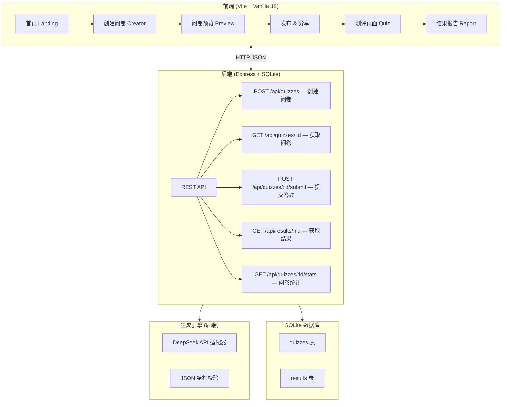
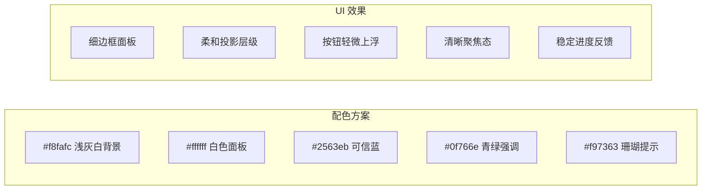

# QuizForge 测趣工坊 — AI 驱动的趣味测评生成平台

## 项目概述

构建一个类似 MBTI/XXTI 风格的趣味测评网站，核心功能为：用户输入一个主题（如"你是哪种咖啡"、"你的职场性格"），系统通过 DeepSeek API 自动生成结构化、有趣、可解释的娱乐问卷，用户可以分享问卷链接给他人测试，并查看详细的测评报告。

### 核心卖点
- 🧠 **DeepSeek 智能生成** — 输入主题即可生成维度与题目，后端补齐 16 种结果报告
- 🎯 **结构化娱乐评分** — 采用类人格维度评分模型（类 MBTI 四维对立）
- 🎨 **精美报告** — 雷达图 + 类型匹配 + 个性化描述
- 🔗 **一键分享** — 干净短链接 + 二维码，病毒式传播

---

## User Review Required

> [!IMPORTANT]
> **AI API 选择**：当前直接接入 **DeepSeek 官方 API**，默认模型为 `deepseek-v4-flash`，用于降低等待时间。
>
> **失败策略**：如果 API Key 缺失、网络超时或 DeepSeek 返回错误，系统直接展示失败提示，不使用本地模板兜底，确保演示和真实能力一致。

## Open Questions

1. **项目名称**：暂定"QuizForge 测趣工坊"，是否有其他偏好？
2. **语言**：界面语言默认中文，是否需要中英双语？
3. **部署方式**：当前优先本地运行 + SQLite。Vercel / Railway 等平台部署留作未来考虑，届时需重新评估持久化存储。
4. **问卷规模**：默认生成 12 道题 + 4 个维度 + 16 种结果类型，是否合适？

---

## 技术架构



### 技术栈

| 层面 | 技术选型 | 理由 |
|------|---------|------|
| **前端** | | |
| 构建工具 | Vite | 快速 HMR，现代化开发体验 |
| 核心语言 | Vanilla JS (ES Modules) | 轻量，无框架依赖 |
| 样式 | Vanilla CSS (CSS Variables) | 灵活控制，白色背景，清爽产品化界面 |
| 图表 | Chart.js | 雷达图、柱状图可视化 |
| 二维码 | QRCode.js | 分享二维码生成 |
| 字体 | Google Fonts (Noto Sans SC + Inter) | 中英文混排美观 |
| **后端** | | |
| 运行时 | Node.js | 前后端同一语言 |
| 框架 | Express | 轻量、成熟、生态丰富 |
| 数据库 | SQLite (`node:sqlite`) | 零配置，单文件数据库，部署简单 |
| AI 生成 | DeepSeek API (`deepseek-v4-flash`) | 分块生成结构化维度与题目 JSON |
| 生成进度 | Server-Sent Events (SSE) | 后端分块生成时向前端推送真实进度 |
| 短 ID | nanoid | 生成美观短链 ID（如 `q_Xk8mP2`） |
| 跨域 | cors | 开发环境跨域支持 |

### 为什么选 SQLite？

> [!TIP]
> SQLite 是当前本地 MVP 的轻量级选择：
> - **零配置**：不需要安装 MySQL / PostgreSQL，数据库就是一个文件
> - **性能足够**：支撑比赛演示和早期小规模使用
> - **本地部署简单**：数据库随项目文件走，一个 `npm start` 就跑起来
> - **未来可扩展**：如需上云或多人长期使用，可迁移到 PostgreSQL

---

## Proposed Changes

### 1. 项目结构

#### [NEW] 完整项目目录

```
开源创新大赛/
├── package.json               # 根 package.json（monorepo 管理）
│
├── server/                    # 后端
│   ├── index.js               # Express 入口
│   ├── db.js                  # SQLite 数据库初始化 & 操作
│   ├── routes/
│   │   ├── quizzes.js         # 问卷 CRUD API
│   │   └── results.js         # 答题结果 API
│   ├── engine/
│   │   ├── generator.js       # 问卷生成引擎（DeepSeek + 校验）
│   │   ├── ai-adapter.js      # DeepSeek API 适配器
│   │   └── scorer.js          # 评分算法
│   └── data/
│       └── quizforge.db       # SQLite 数据库文件（自动创建）
│
├── client/                    # 前端 (Vite)
│   ├── index.html             # 入口 HTML
│   ├── vite.config.js         # Vite 配置（含 API 代理）
│   ├── src/
│   │   ├── main.js            # 应用入口
│   │   ├── router.js          # Hash 路由器
│   │   ├── style.css          # 全局样式 & 设计系统
│   │   ├── api.js             # 后端 API 封装
│   │   ├── pages/
│   │   │   ├── home.js        # 首页
│   │   │   ├── creator.js     # 创建问卷页
│   │   │   ├── quiz.js        # 做题页
│   │   │   └── result.js      # 结果报告页
│   │   ├── components/
│   │   │   ├── header.js      # 导航头
│   │   │   ├── quiz-card.js   # 问卷卡片
│   │   │   ├── progress-bar.js# 进度条
│   │   │   └── share-modal.js # 分享弹窗
│   │   └── utils/
│   │       └── share.js       # 分享工具
│   └── public/
│       └── favicon.svg
```

---

### 2. 后端设计

#### [NEW] [db.js](file:///Users/onelittlechild/Desktop/开源创新大赛/server/db.js) — 数据库

**表结构设计：**

```sql
-- 问卷表
CREATE TABLE quizzes (
    id          TEXT PRIMARY KEY,    -- nanoid 短 ID（如 "q_Xk8mP2"）
    schema_version INTEGER DEFAULT 1,-- 数据结构版本
    title       TEXT NOT NULL,       -- 问卷标题
    topic       TEXT NOT NULL,       -- 用户输入的主题
    dimensions  TEXT NOT NULL,       -- 维度定义 JSON
    questions   TEXT NOT NULL,       -- 题目列表 JSON
    results     TEXT NOT NULL,       -- 结果类型定义 JSON
    created_at  TEXT DEFAULT (datetime('now')),
    play_count  INTEGER DEFAULT 0    -- 测评次数
);

-- 答题结果表
CREATE TABLE quiz_results (
    id          TEXT PRIMARY KEY,    -- nanoid 短 ID
    quiz_id     TEXT NOT NULL,       -- 关联问卷 ID
    answers     TEXT NOT NULL,       -- 用户答案 JSON
    scores      TEXT NOT NULL,       -- 维度得分 JSON
    type_code   TEXT NOT NULL,       -- 结果类型代码（如 "ENTJ"）
    created_at  TEXT DEFAULT (datetime('now')),
    FOREIGN KEY (quiz_id) REFERENCES quizzes(id)
);

CREATE INDEX idx_quiz_results_quiz_id ON quiz_results(quiz_id);
CREATE INDEX idx_quiz_results_created_at ON quiz_results(created_at);
CREATE INDEX idx_quizzes_created_at ON quizzes(created_at);
```

#### [NEW] [routes/quizzes.js](file:///Users/onelittlechild/Desktop/开源创新大赛/server/routes/quizzes.js) — 问卷 API

| 端点 | 方法 | 功能 | 说明 |
|------|------|------|------|
| `/api/quizzes/jobs` | POST | 创建生成任务 | 接收主题 → 返回 job ID 和 SSE 进度地址 |
| `/api/quizzes/jobs/:jobId/events` | GET | 生成进度流 | 使用 SSE 推送分块生成进度，完成后返回问卷 |
| `/api/quizzes` | POST | 创建问卷 | 兼容接口：接收主题 → 调用生成引擎 → 存入数据库 → 返回问卷 ID |
| `/api/quizzes/:id` | GET | 获取问卷 | 根据短 ID 返回完整问卷数据（做题用） |
| `/api/quizzes/:id` | PATCH | 编辑问卷 | 保存标题、简介、题目和选项文案 |
| `/api/quizzes/popular` | GET | 热门问卷 | 按 play_count 排序返回热门问卷 |

#### [NEW] [routes/results.js](file:///Users/onelittlechild/Desktop/开源创新大赛/server/routes/results.js) — 结果 API

| 端点 | 方法 | 功能 | 说明 |
|------|------|------|------|
| `/api/quizzes/:id/submit` | POST | 提交答案 | 接收答案 → 计算得分 → 存储结果 → 返回结果 ID |
| `/api/results/:rid` | GET | 查看结果 | 根据结果 ID 返回完整报告数据 |
| `/api/quizzes/:id/stats` | GET | 问卷统计 | 返回各类型占比、参与人数等聚合数据 |

#### [NEW] [index.js](file:///Users/onelittlechild/Desktop/开源创新大赛/server/index.js) — Express 入口

- 挂载 API 路由
- 生产模式下 serve 前端静态文件
- 端口 `3000`
- CORS 配置（开发环境放行前端 `5173` 端口）

**分享链接效果（对比）**：

```
❌ 无后端：https://domain.com/#/quiz?data=eJzNVk1v4zYQ...（几百字符）
✅ 有后端：https://domain.com/#/quiz/q_Xk8mP2 ← 干净！

❌ 无后端结果：https://domain.com/#/result?data=eJzLSM3J...
✅ 有后端结果：https://domain.com/#/result/r_7nBx3Q ← 可分享！
```

---

### 3. 问卷生成引擎（后端）

#### [NEW] [engine/generator.js](file:///Users/onelittlechild/Desktop/开源创新大赛/server/engine/generator.js) — DeepSeek 问卷生成引擎

**核心流程**：分块调用 DeepSeek API 生成类 MBTI 的四维对立模型和各维度题目，并对返回 JSON 做结构校验

```
输入："你是哪种咖啡？"

→ DeepSeek 分析主题类别（食物/性格/职业/兴趣...）并生成 4 个维度

→ 生成 4 对对立维度：
  - 浓度维度：浓烈(E) vs 清淡(I)
  - 口味维度：经典(S) vs 创新(N)
  - 温度维度：热情(F) vs 冷静(T)
  - 风格维度：精致(J) vs 随性(P)

→ 按维度分块调用 DeepSeek，每个维度生成 3 道情景题（共 12 道），每题 5 档选项：+2 / +1 / 0 / -1 / -2

→ 后端按 4 个维度排列组合生成 2⁴ = 16 种结果类型
  如 "ESFT" → "经典意式浓缩"
     "INTP" → "创意冰滴冷萃"
```

**结构校验**：第一块返回必须包含 4 个维度；后续每个维度块必须返回 3 道题，每题必须有 5 档选项且包含中间选项。16 种结果类型由后端根据维度组合生成，降低单次 AI 输出长度并提升生成稳定性。

#### [NEW] [engine/scorer.js](file:///Users/onelittlechild/Desktop/开源创新大赛/server/engine/scorer.js) — 评分引擎

- 每道题的选项对应五档维度得分（+2 / +1 / 0 / -1 / -2），允许中间态
- 维度得分汇总 → 判断极性 → 组合为类型代码
- 计算每个维度的倾向百分比（如 E:72% / I:28%）

#### [NEW] [engine/ai-adapter.js](file:///Users/onelittlechild/Desktop/开源创新大赛/server/engine/ai-adapter.js) — DeepSeek API 适配器

- 统一接口 `generateQuiz(topic)`
- 默认模型 `deepseek-v4-flash`
- 使用 DeepSeek OpenAI-compatible Chat Completions 接口
- 显式关闭 thinking mode，避免推理内容占用输出 token，提升 JSON 返回稳定性
- 使用 JSON 输出模式，确保 AI 输出规范的维度与题目 JSON
- 失败策略：API 失败时直接返回错误，不使用模板兜底
- **安全性**：API Key 保存在后端环境变量中，不暴露给前端

---

### 4. 前端设计

#### [NEW] [style.css](file:///Users/onelittlechild/Desktop/开源创新大赛/client/src/style.css) — 设计系统

**设计语言：** 白色背景 + 清爽产品化界面 + 克制色彩强调

- **配色方案**：
  - 主背景：`#f8fafc`（浅灰白）
  - 面板：`#ffffff` + 细边框 + 柔和阴影
  - 主色：`#2563eb`（可信蓝）
  - 辅色：`#0f766e`（青绿）/ `#f97363`（珊瑚）
  - 文字：`#0f172a`（深墨色）
- **动效系统**：
  - 页面切换：轻量淡入
  - 按钮悬停：轻微上浮 + 阴影变化
  - 卡片：边框高亮 + 阴影层级
  - 进度条：稳定蓝色进度反馈
- **响应式**：移动优先，断点 `768px` / `1200px`

#### [NEW] [api.js](file:///Users/onelittlechild/Desktop/开源创新大赛/client/src/api.js) — API 客户端

封装所有后端请求：

```js
export const api = {
  createQuiz(topic)        → POST /api/quizzes
  getQuiz(id)              → GET  /api/quizzes/:id
  getPopularQuizzes()      → GET  /api/quizzes/popular
  submitAnswers(id, data)  → POST /api/quizzes/:id/submit
  getResult(rid)           → GET  /api/results/:rid
  getStats(id)             → GET  /api/quizzes/:id/stats
}
```

#### [NEW] [vite.config.js](file:///Users/onelittlechild/Desktop/开源创新大赛/client/vite.config.js) — Vite 配置

- 开发环境 API 代理：`/api` → `http://localhost:3000`
- 生产构建输出到 `../server/public`（后端直接 serve）

#### [NEW] 页面模块

与之前方案相同，变化在于数据来源从 localStorage 改为 API 调用：

- **home.js** — 首页：热门问卷从 API 获取
- **creator.js** — 创建页：创建后端生成任务，通过 SSE 展示真实生成进度，生成后允许编辑标题、简介、题目和选项文案
- **quiz.js** — 做题页：通过 `GET /api/quizzes/:id` 加载问卷，完成后 `POST` 提交答案
- **result.js** — 结果页：通过 `GET /api/results/:rid` 加载结果 + 统计数据

---

### 5. 分享机制

#### [NEW] [share.js](file:///Users/onelittlechild/Desktop/开源创新大赛/client/src/utils/share.js)

**分享流程（简化版）**：
1. 问卷创建后，后端返回短 ID（如 `q_Xk8mP2`）
2. 生成分享 URL：`https://domain.com/#/quiz/q_Xk8mP2` — **干净美观！**
3. 测评完成后，结果也有短 ID：`https://domain.com/#/result/r_7nBx3Q`
4. 支持：
   - 📋 复制链接
   - 📱 生成二维码（QRCode.js）
   - 📊 Web Share API（移动端原生分享）
   - 🖼️ Canvas 生成结果图片（含类型 + 雷达图）

---

### 6. 开发与运行

#### 开发流程

```bash
# 安装依赖
npm install

# 同时启动前后端（concurrently）
npm run dev
# → 后端 http://localhost:3000
# → 前端 http://localhost:5173（Vite，自动代理 API 到 3000）

# 生产构建
npm run build    # 构建前端到 server/public
npm start        # 只启动后端（serve 静态文件 + API）
```

---

## 视觉设计参考



---

## Verification Plan

### Automated Tests
1. **构建验证**：`npm run build` 确认无编译错误
2. **API 测试**：用 curl 或浏览器测试完整 CRUD 流程
3. **浏览器测试**：使用 browser subagent 验证以下流程：
   - 首页加载 → 创建问卷 → 生成完成 → 分享
   - 通过分享链接打开问卷 → 做题 → 查看结果
   - 分享结果页面给他人查看
   - 移动端视图响应式检查

### Manual Verification
- 生成问卷的质量和趣味性人工审核
- 分享链接在不同浏览器中的兼容性
- 结果页面截图质量检查
